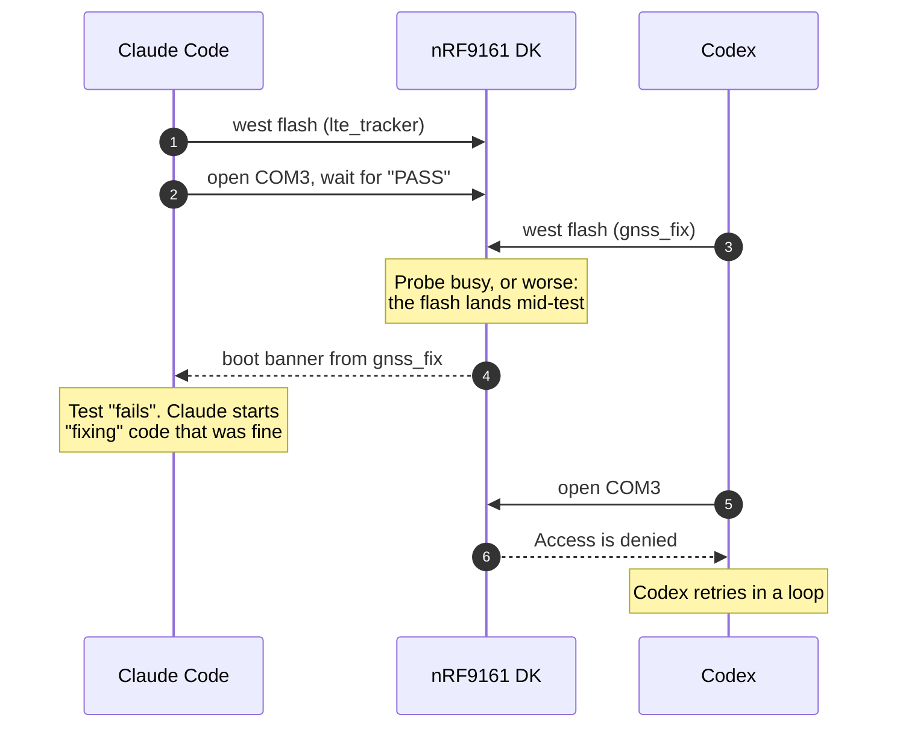
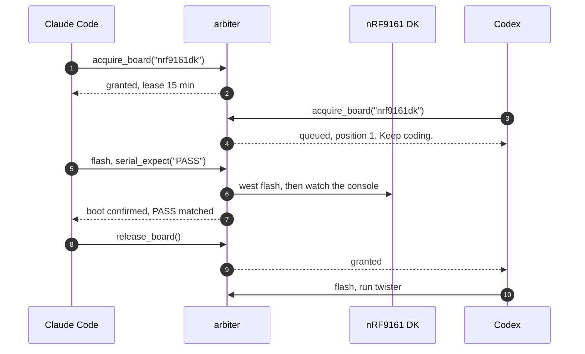
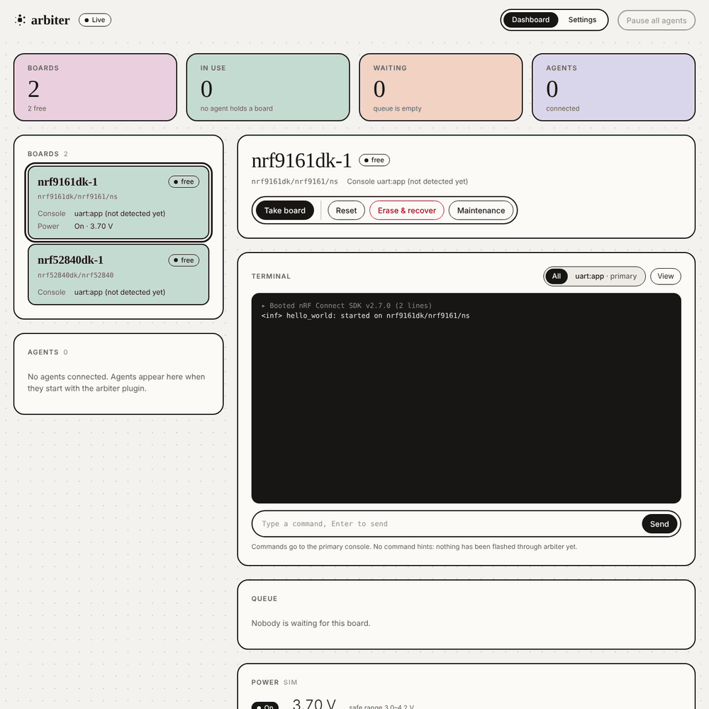
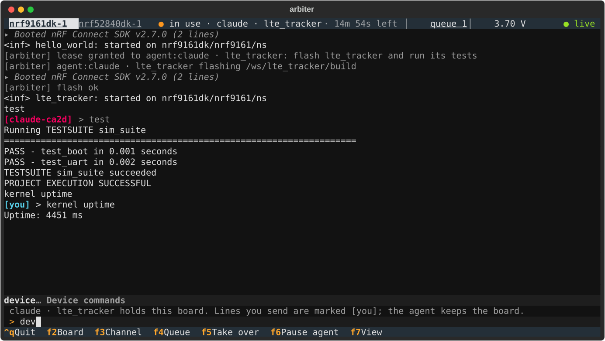
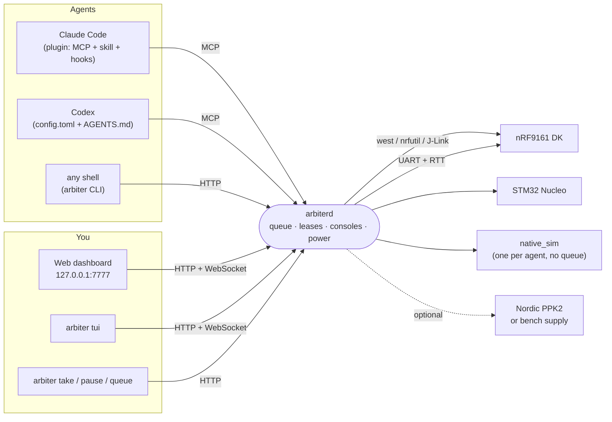

<p align="center">
  <picture>
    <source media="(prefers-color-scheme: dark)" srcset="docs/logo/arbiter-logo-dark.svg">
    
  </picture>
</p>

<h1 align="center">arbiter</h1>

<p align="center">
  <b>One dev board. Many AI agents. No fights.</b><br>
  A hardware-in-the-loop broker that lets Claude Code, Codex and you share real Zephyr boards:<br>
  agents queue, flash, read the console and run tests. You watch every byte and can step in at any moment.
</p>

<p align="center">
  <a href="https://github.com/famesy/arbiter/actions/workflows/ci.yml"></a>
  
  
  
</p>

<p align="center">
  
  <br><sub>Claude Code holds the board and runs its tests. Codex asks for the same board, waits its turn, and gets it the moment Claude lets go.</sub>
</p>

---

## The 2 a.m. problem

You have one nRF9161 DK on your desk and two coding agents working on the firmware. Claude Code is fixing the LTE tracker; Codex is chasing a GNSS bug. Both are good at their jobs. Both want the board *now*.

Here is what happens without arbiter:



Nobody wins. Claude spends twenty minutes debugging a failure that Codex caused. Codex hammers a serial port it can't open. And when you sit down in the morning, the board is running an image nobody remembers flashing, and you can't tell who did what.

Now the same night with arbiter:



One process owns the probes and serial ports. Agents take turns. Every byte the board prints is recorded, and you can watch it live, type into it, or take the board away at any moment.

### Before and after

| | Without arbiter | With arbiter |
|---|---|---|
| **Two agents, one board** | Whoever runs `west flash` last wins. The other agent's test reads the wrong firmware. | A fair queue. The second agent gets a ticket and keeps coding until it's their turn. |
| **Serial port** | One process opens COM3; everyone else gets `Access is denied`. | arbiter owns the port and hands each agent the console, split into channels (`uart:app`, `uart:tfm`, `rtt`). |
| **"Did it actually boot?"** | The agent sees `*** Booting MCUboot` and calls it a pass. | `flash` waits for *your* image's banner and reports `boot_confirmed: false` when a stale bootloader is still in charge. |
| **A crashed agent** | Holds the board until you notice. | Heartbeats stop, the lease is reclaimed in under a minute, and the next agent in line gets it. |
| **You need the board** | Kill the agents, hope nothing is mid-flash. | Click **Take over**. The agent is told why and waits at the front of the queue. Click **Give back** when you're done. |
| **What happened overnight?** | Scroll back through two agent transcripts and guess. | One timeline: who held which board, what they flashed, every console line, every test run. |
| **Dangerous commands** | An agent "helpfully" runs `nrfutil device recover` on your only DK. | Raw `west flash`, J-Link, `openocd` and serial tools are blocked by a hook. Erase and recover wait for your approval. |

## See it work

Every recording below is the real arbiter daemon and dashboard, driven by real `arbiter` agent sessions against simulated boards.

<table>
  <tr>
    <td width="50%" valign="top">
      
      <p><b>An agent flashes and tests.</b> Claude acquires the nRF9161 DK, flashes <code>lte_tracker</code>, waits for the boot banner and runs the test suite. Every line lands in the live terminal, tagged with who sent it.</p>
    </td>
    <td width="50%" valign="top">
      
      <p><b>The queue hands over.</b> Codex asks while Claude is busy, gets position 1 and keeps working. The moment Claude releases, the board is Codex's.</p>
    </td>
  </tr>
  <tr>
    <td width="50%" valign="top">
      
      <p><b>Type alongside the agent.</b> Curious what the board is doing? Type <code>kernel uptime</code> into the same console. Your lines are marked <code>[you]</code>; the agent keeps its lease.</p>
    </td>
    <td width="50%" valign="top">
      
      <p><b>Take over, then give back.</b> One click and the board is yours. The agent is told a human has it and waits at the front of the line. Give it back and it carries on.</p>
    </td>
  </tr>
</table>

### Or stay in your terminal

Most embedded work happens in a terminal, so arbiter is getting a terminal UI too: `arbiter tui` puts the board console front and centre, with one status line on top and an F-key bar (it works with the mouse) for boards, channels, queue, take over, pause and view options. It is in review in [#28](https://github.com/famesy/arbiter/pull/28).

<p align="center">
  
</p>

## Proven on a real board

arbiter was built against a real **nRF9161 DK** on Windows 11 with nRF Connect SDK v3.4.1 and a J-Link. On that board:

- A real Claude Code agent with the plugin loaded its 19 tools, read the etiquette skill, acquired the board, flashed MCUboot plus `hello_world` (14.5 s), matched `Hello World` on `uart:app`, ran twister through `run`, and released the board every time. It never erased or retried on its own.
- Two agents asked for the board at once. The second was queued at position 1 and was granted the board the instant the first released it.
- An agent was killed mid-lease. Its board went to the next agent in line 54 seconds later, without anyone touching anything.
- A test run left an old MCUboot on the chip that printed `Unable to find bootable image`. arbiter now reports `boot_confirmed: false` with a plain explanation, instead of letting the next agent inherit a dead board.
- TF-M's own boot log showed up on its own channel (`uart:tfm`), separate from the app console (`uart:app`).

The full write-ups are in [`docs/hw-validation-nrf9161dk.md`](docs/hw-validation-nrf9161dk.md) and [`docs/architecture.md`](docs/architecture.md).

## How it fits together



- **`arbiterd`** is a Python asyncio daemon on the machine the boards are plugged into. It is the only process that touches probes and serial ports.
- **Agents** connect through an MCP server (`arbiter mcp`). Tools include `acquire_board`, `wait_for_board`, `flash`, `serial_expect`, `serial_write`, `console_read`, `run`, `measure_current` and `release_board`.
- **Queueing never blocks an agent.** `acquire_board` returns a lease or a ticket. Leases have a TTL kept alive by heartbeats, so a crashed agent can't hold a board hostage.
- **Consoles** are UART or RTT, picked automatically from the build's `.config`, the ELF or a runtime probe. Every output is recorded as a named channel.
- **Power** is optional: a Nordic PPK2, an external supply, or your own script, with per-board voltage and current limits.
- **Your hardware, your rules.** Override any action with your own command in `config.toml`, describe a board made only of commands, or write a Python driver plugin.

## Get started

**1. Install the plugin in Claude Code.**

```text
/plugin marketplace add famesy/arbiter
/plugin install arbiter@arbiter
```

**2. Let Claude set it up.**

```text
/arbiter:setup
```

Claude installs the `arbiter` command if it's missing (after asking), runs `arbiter init` to find your probes and nRF Connect SDK, shows you the `config.toml` it would write and writes it only when you say yes, then checks everything with `arbiter doctor`.

**3. Watch the boards.** In your own terminal:

```sh
arbiter dashboard     # opens the web dashboard
```

The daemon starts on its own when an agent needs it; `arbiter daemon` runs it in the foreground. With no config at all, arbiter starts one simulated board, so you can try the whole flow before plugging anything in.

**Using Codex?** Copy [`codex/config.toml`](codex/config.toml) into `~/.codex/config.toml` and paste [`codex/AGENTS.md`](codex/AGENTS.md) into your firmware repo's `AGENTS.md`. Codex talks to the same daemon and waits in the same queue.

## Example prompts

You don't need to learn the tools. Talk to your agent the way you'd talk to a teammate, and the board-etiquette skill turns it into the right calls.

| You say | What the agent does through arbiter |
|---|---|
| *"Build `samples/hello_world` for the nRF9161 DK, flash it and check it boots."* | `acquire_board` → `flash` (waits for the banner, `boot_confirmed: true`) → `serial_expect("Hello World")` → `release_board` |
| *"Run the twister tests in `tests/lte` on the real board."* | Acquires the DK, starts twister through `run` (arbiter adds the hardware map and the console bridge), polls `run_status`, summarises pass and fail, releases |
| *"The GNSS fix never arrives on hardware. Find out why."* | Flashes a debug build, reads `uart:app` and `uart:tfm` with `console_read`, types shell commands with `serial_write`, and narrows it down |
| *"Measure the sleep current of this build at 3.7 V."* | Acquires a board with a PPK2, sets the voltage within your limits, calls `measure_current` (RTT is detached first so it doesn't spoil the number) |
| *"Check the parser on `native_sim` first, then on the DK."* | Gets its own `native_sim` instance at once with no queue, and only asks for the real board once that passes |
| *"The board is taken. Keep working on the docs and try again later."* | Keeps its ticket, carries on, and calls `wait_for_board` from time to time. Its place in line is never lost |
| *"Set up arbiter for my boards."* | `/arbiter:setup`: drafts the config from the probes it finds and asks you before writing anything |

And from your side of the desk:

```sh
arbiter status            # every board, who holds it, and the queue
arbiter take nrf9161dk-1  # the board is yours; the agent waits at the front
arbiter resume nrf9161dk-1
arbiter queue             # reorder, prioritise or remove waiting agents
arbiter approve <id>      # an agent asked to erase or recover a board
```

## What else is in the box

- **Guardrails.** A `PreToolUse` hook blocks raw `west flash`, `nrfutil device`, J-Link tools, `openocd`, `pyocd` and direct serial access, and tells the agent what to use instead. Erasing or recovering a board asks you first.
- **Console channels.** `uart:app`, `uart:tfm`, `rtt` and anything else a board prints are recorded side by side. Agents read the one they need; you see them all.
- **Shell completion from the image.** arbiter reads the Zephyr shell commands out of the flashed ELF, so Tab in the dashboard (and `shell_commands` for agents) suggests real commands.
- **Pause and preemption.** Pause an agent mid-lease and its hardware tools return `LEASE_PAUSED` with a clear hint until you resume.
- **`native_sim` boards.** A pool with no queue: each agent gets its own instance (Linux, or WSL on Windows).
- **Linux and Windows first-class.** macOS should work but isn't tested.

## Layout

| Path | What's there |
|---|---|
| [`docs/architecture.md`](docs/architecture.md) | The design doc |
| [`docs/hw-validation-nrf9161dk.md`](docs/hw-validation-nrf9161dk.md) | What a real nRF9161 DK showed about the design's assumptions |
| [`backend/`](backend/) | The `arbiterd` service, the `arbiter` CLI, the MCP server and the web dashboard |
| [`plugin/`](plugin/) | The Claude Code plugin: MCP server config, the board-etiquette and setup skills, and hooks |
| [`codex/`](codex/) | The same setup for Codex: a `config.toml` snippet and `AGENTS.md` rules |
| [`ui/`](ui/) | The dashboard's component library and Storybook |
| [`docs/media/`](docs/media/) | The recordings in this README |

## Status

Working end to end on a real nRF9161 DK with real Claude Code agents, and still young. Expect rough edges, and please open an issue when you hit one.

## Development

Style and type checks run on every pull request (`.github/workflows/ci.yml`). Run the same checks locally:

```sh
pip install -r requirements-dev.txt
pre-commit install          # ruff lint + format and file hygiene on each commit
pre-commit run --all-files  # what the CI "Style" job runs
mypy                        # what the CI "Types" step runs (strict)
pytest backend/tests -m "not integration"
```

Tool settings live at the repo root: `ruff.toml`, `mypy.ini`, `.pre-commit-config.yaml`. Keep `[tool.ruff]` and `[tool.mypy]` out of `backend/pyproject.toml`, so there is one source of truth.

Integration tests (`@pytest.mark.integration`) never run by default. Start them from **Actions > Integration > Run workflow**, choosing `simulated` or `hardware` (a self-hosted runner labelled `arbiter-hw` with the boards attached), or add the `run-integration` label to a pull request.

The GIFs in [`docs/media/`](docs/media/) are recorded from the real dashboard with Playwright and Chromium, driving `arbiter` agent sessions against simulated boards.
